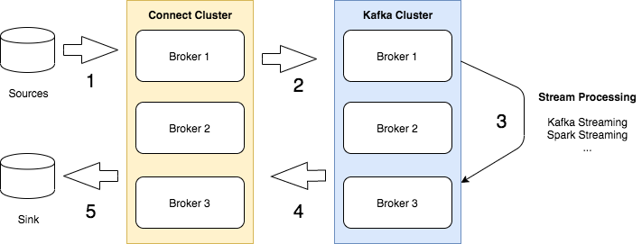

# Kafka Connect


Download jar files from https://github.com/jcustenborder/kafka-connect-twitter/releases.

```
cd kafka/connect

curl -sL https://github.com/jcustenborder/kafka-connect-twitter/releases/download/0.2.26/kafka-connect-twitter-0.2.26.tar.gz -o kafka-connect-twitter.tar.gz

tar -zxf kafka-connect-twitter.tar.gz
```

Confirm all the required jar files are located at usr/share/kafka-connect/kafka-connect-twitter location.

Ensure "plugins.path" location in connect-standalone.properties file is pointing to usr/share/kafka-connect (or equivalent on your machine). 

Enter Twitter developer credentials in twitter.properties file and update your search terms.

Create topics
```
kafka-topics.sh --zookeeper 127.0.0.1:2181 --create --topic twitter_status_connect --partitions 3 --replication-factor 1
kafka-topics.sh --zookeeper 127.0.0.1:2181 --create --topic twitter_delete_connect --partitions 3 --replication-factor 1
```

Start CLI consumer 
```
kafka-console-consumer.sh --bootstrap-server localhost:9092 --topic twitter_status_connect --group app2
```

Run Connect and check if you can see the twitter results in the consumer CLI window.
```
connect-standalone.sh connect-standalone.properties twitter.properties
```


---

Confluent maintains the connnectors to various source and sinks. You can view the complete list of sources and sinks at https://www.confluent.io/hub/.
To use one of the connector, install Confluent Hub Client using the following comamnds.
```
cd ~
curl -sL http://client.hub.confluent.io/confluent-hub-client-latest.tar.gz -o confluent-hub.gz

mkdir -p confluent-hub && tar -zxf confluent-hub.gz -C confluent-hub
echo "export PATH=${PWD}/confluent-hub/bin:\$PATH" >>~/.bashrc
source ~/.bashrc
```

Install Twiter connector using Confluent Hub Client
```
confluent-hub install jcustenborder/kafka-connect-twitter:0.3.33
```
