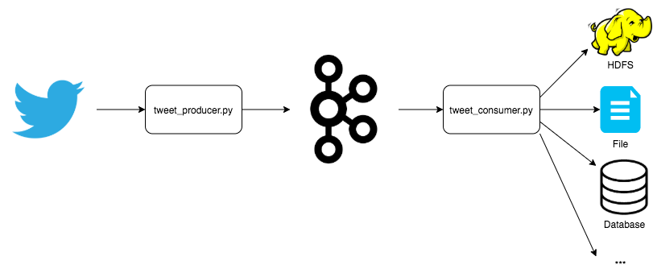

# Kafka Producer and Consumer in Python



Instructions to install Python3.x on Debian 9
```
sudo apt update
sudo apt install python3-pip
pip3 --version
```
 
Install required libraries
```
pip3 install kafka
pip3 install kafka-python
pip3 install python-twitter
pip3 install tweepy
pip3 install configparser
```

Create a Kafka topic called covid
```
kafka-topics.sh --create --zookeeper localhost:2181 --replication-factor 1 --partitions 3 --topic covid
```

Run Kafka consumer on CLI to watch for the tweets
```
kafka-console-consumer.sh --bootstrap-server localhost:9092 --topic covid --group app1
```

```
cd kafka/consumer-producer/python
```
Update your Twitter developer app credentials in config.cfg file. Refer to https://themepacific.com/how-to-generate-api-key-consumer-token-access-key-for-twitter-oauth/994/

Run the twitter kafka producer program. CTRL + C to stop streaming after few seconds.
```
python3 twitter_producer.py
```

Check how many tweets are in the topic by partition
```
kafka-consumer-groups.sh --bootstrap-server localhost:9092 --describe --group app1
```
